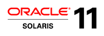

In this lab we introduce the most interesting features of Oracle Solaris 11,
based on real life use cases. We will:

-   create a disk pool and a file system with ZFS; expand it; snapshot and
    clone it; use ZFS compression and deduplication; use ZFS migration for
    backup: [ZFS Lab](zfs/zfs.md)
-   create a new boot environment as a backup, make our current system
    unbootable because of some fatal mistakes, reboot the system using
    backup BE: [Boot Environments Lab](be/be.md)
-   use new packaging system called IPS to search, install, verify and
    fix packages; update the system using IPS and Boot Environments
    together: [IPS Lab](ips/ips.md)
-   use new networking commands, configure virtual network interfaces: [Networking Lab](net/net.md)
-   create a couple of Solaris virtual environments (zones); install some
    applications into them; clone a zone; use Resource Management with the zones: [Virtualization Lab](virt/virt_pre.md)
-   learn how to install systems and zones with Automated Installer: [AI Lab](ai/ai_intro.md)
-   compare two virtualization options available in Oracle Solaris: non-global
    zones and kernel zones: [Kernel Zones Lab](kz/kz.md) 

Prerequisites
-------------

This lab requires access to an Oracle Solaris 11 system either natively or in a
VirtualBox virtual machine.

### Using Virtual Box VM

If you're performing this lab on your laptop or desktop, we've provided
a VirtualBox appliance that contains all the software and configuration
necessary to complete this lab. All you need is VirtualBox software and
a modern (with a CPU supporting virtualization turned on, AMD-V or VT-x)
laptop/desktop with at least 3 GB of RAM and 10GB of free disk space.

-   Download and install the latest version of VirtualBox for your
    platform (http://www.virtualbox.org/wiki/Downloads).
-   Download and install the latest version of VirtualBox Extensions
    Pack (http://www.virtualbox.org/wiki/Downloads).
-   Download or find on the provided DVD/USB and import the Hands On Lab
    machine into VirtualBox (File &gt; Import Appliance). You will have
    to accept the OTN Oracle Solaris license to use the appliance.
    
The Environment
---------------

In this lab we are going to use Oracle Solaris 11 virtual appliance in
Oracle VirtualBox environment. If you are using lab machines, the
appliance is already installed. You can also download the appliance from
Oracle Technology Network: (http://www.oracle.com/technetwork/server-storage/solaris11/downloads/vm-templates-2245495.html)

By default, VirtualBox assigns the IP address `10.0.2.15` to the Solaris
global zone. We will be using also IP addresses `10.0.2.21` and `10.0.2.22`
for local zones. As we are using VirtualBox in NAT (network address
translation) mode, this shouldn't interfere with your outside network
environment.

You should login into Solaris desktop with the following credentials:

Username: `lab` Password: `oracle1`

After logging in, open a terminal window and assume the `root` role:

``` console
lab@solaris:~$ su - 
```

Password for root is: `solaris1`.

Note: we don't recommend to log in as `root`. In Oracle Solaris 11 it is
prohibited by default; `root` is only a role, not a login name.

Putting It All Together
-----------------------

The whole idea of this lab is to show you some Oracle Solaris 11 features that
can be used to create a cloud infrastructure based on Solaris. You have
just created storage pools and filesystems&mdash;think cloud storage. It
was fast, it was simple, it was flexible. You have created and cloned
Solaris zones with applications within them&mdash;think _cloud machine
instances_. You have monitored and managed zones resources&mdash;think _cloud
elasticity, metering and chargeback_. Add to that 
Solaris _network virtualization_, Solaris _security_, Solaris _software lifecycle
management_ and many other features which make Oracle Solaris 11 truly
cloud-oriented operating system. Try them and learn more about Solaris 11!

Final Notes
-----------

The virtual appliance we used in this lab is configured to be able to
perform zone installation without network access. Namely, we've
configured an internal repository with just a small subset of packages
necessary for zone installations. If you are going to continue using
this appliance with open network access, you will need to change the
repository address to Oracle's standard Solaris repository.

``` console
root@solaris:~# pkg set-publisher -G '*' -M '*' -g http://pkg.oracle.com/solaris/release -P solaris 
```

Further Oracle Solaris Education
--------------------------------

This Hands-on Lab is just and introduction in Oracle Solaris 11 world.
We highly recommend to continue your education with Oracle University.
There is a full set of new courses covering Oracle Solaris 11:

-   Transition to Oracle Solaris 11
-   What's New in Oracle Solaris 11
-   What's New in Oracle Solaris 11 (Self-Study)
-   Oracle Solaris 11 System Administration
-   Oracle Solaris 11 Advanced System Administration

Get more details at the Oracle University page:
<http://bit.ly/OracleSolaris11Edu> .

If you prefer to study Oracle Solaris 11 on your own, there are a lot of books
available: [Oracle Solaris 11 books on Amazon](https://www.amazon.com/s/ref=nb_sb_noss?url=search-alias%3Daps&field-keywords=oracle+solaris+11)

Don't miss Oracle Solaris channel on YouTube: https://www.youtube.com/OracleSolaris and especially the screencasts of most of the labs in this course:

- [Season 1: The Basics](https://www.youtube.com/playlist?list=PLrEMJQQgYLXhZ9-Qfc2tOVl1xNccg-Fvh)
- [Season 2: Cloud in a Box](https://www.youtube.com/playlist?list=PLrEMJQQgYLXi9BJb0zd2hU63EP4qHqiQl)
- [Season 3: Tips and Tricks](https://www.youtube.com/playlist?list=PLrEMJQQgYLXgyH6YC-OVIhnTIwwkaPpRP)

